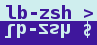

# lb-zsh
zsh goodies for LHCb

## target audience
A collection of zsh completion functions to make everyday life of zsh users in
[LHCb](http://lhcb-public.web.cern.ch/lhcb-public/) easier.

The focus is analysts who use 5% of the options 95% of the time. Experts who
need all options of all tools may want to do a bit more.

## what's shipped and what's not
The package should not contain general zsh features which are useful outside of
LHCb as well. Instead it is planned to contain only features which are useful
to LHCb users only.

A border line case is the completion for `root`.

## demo
See my [blog
post](http://virgilio.mib.infn.it/~seyfert/lb-zsh-developments-and-screencasts.html)
for a screencast.

# helpful pointers

When developing the completions,
[this howto](https://github.com/zsh-users/zsh-completions/blob/master/zsh-completions-howto.org)
was of great help.

stackoverflow/stackexchange posts which helped:
 * http://stackoverflow.com/questions/4824590/propagate-all-arguments-in-a-bash-shell-script
 * http://stackoverflow.com/questions/59838/check-if-a-directory-exists-in-a-shell-script
 * http://stackoverflow.com/questions/2953646/how-to-declare-and-use-boolean-variables-in-shell-script
 * http://stackoverflow.com/questions/8742783/returning-value-from-called-function-in-shell-script
 * http://unix.stackexchange.com/questions/67898/using-the-not-equal-operator-for-string-comparison

# feature list

## git-lb-use
`git lb-use` completes
 * its command line options (e.g. connection protocol)
 * projects from a list of hard coded projects
 * suggests url stubs (cern gitlab, with its ports)

## git-lb-checkout
the git-lb-checkout command gets completed as:
`git lb-checkout [remote/branch-or-tag] [package-in-remote-project]`
The first block only querries accessible branches and tags from
remotes/projects which were added with `lb-use` before. Packages get completed
from the official list of existing packages, filtered according to the project
in the previous argument (when starting with `git lb-checkout
Stripping/master`, only packages associated to the Stripping project get added.
It is not checked if they exist in the chosen branch or tag).

## getpack
The same function which returns a (shortened) list of packages for
git-lb-checkout just provides all packages.

## lb-run

`lb-run` completes projects (from a hard coded list), and suggests version
numbers (checking the list of existing versions, starting to suggest from the
most recent one). Afterwards, any (currenty) executable command gets completed,
and a few common commands get suggested. After that, the completion for the
chosen command is called.
TODO: add nightly support

## lb-dev
just does the first part of `lb-run`, i.e. no completion after the version number.
TODO: add nightly support

## lblogin
`LbLogin` knows about the `-c` option and has a hard coded list of common
`CMTCONFIG` variables. For `afsLbLogin` and `cvmfsLbLogin` that's about it.
For `LbLogin.sh`, also the `_gnu_generic` function is called to parse the help
message and show all documented options.

## GUESS
If you're (deep) inside a CMT project path, the `GUESS` alias will be `PROJECT
VERSION`, which you can use with `SetupProject` or `Lbglimpse`.

## run
Similarly, the `run` function searches for the `run` executable in an `lb-dev`
project.  Not to go too wild, I placed barriers not to go beyond `$HOME` or
`/`.  `run` can handle if it doesn't find `run` (will return an error instead
of wildly running commands). Furhtermore, the `run` function forwards the exit
code of the `run` executable.

## bsub
complete `-q` and queue names, `-R` for CentOS7 submission, hint that `-J` is
the job name.

## bkill
suggest lxbatch job ids

## bjobs
modified default listing

## bkillall
function to kill all lxbatch jobs (asks for confirmation)

## gaudirun.py
complete .py and .opts files and suggest options from --help

## ganga
complete .py files and suggest options from --help

## SetupDaVinci (and others)

Similar to `lb-run`, version numbers (from `SetupDaVinci --list-versions`) are
suggested.

## dirac-dms-lfn-accessURL

The two (for me) interesting grid storage elements are completed, such that I
don't have to call `dirac-dms-lfn-replicas` just to look up how the CERN EOS
MC storage element is called.

## general TODO
None of the commands checks against the current `CMTCONFIG`.
